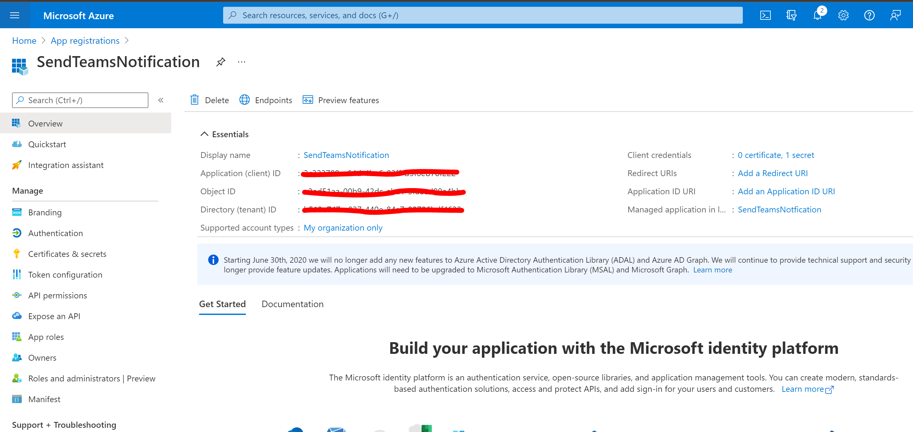
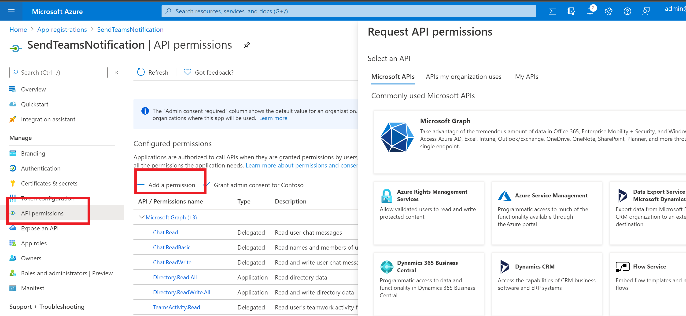
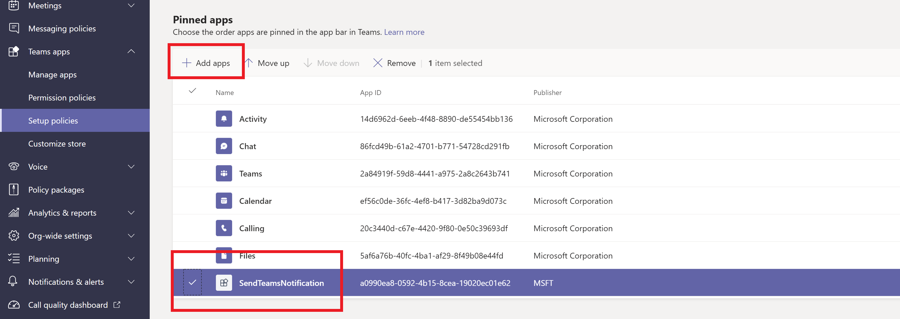

# Teams-Notification Overview and Deployment Guide

**Teams-Notification** solution is for communication with members of one or multiple O365 groups within your company tenant. This solution enables you to broadcast a notification and also bring user attention to a particular notification by sending reminders. This solution enables you to provide richer experience to users and better engage with them by keeping them up to date with your company communication and various changes regarding apps and workflows used by them. 

Use this solution for scenarios like updates about townhalls, announcements, sending content updates of Microsoft 365 Learning Pathways, such as new trainings, URLs to learn more about Microsoft Outlook, SharePoint and Teams.

## Key Features

1. **Custom Notification:** Send company wide communication through 1:1 custom messages/ adaptive cards for a more engaging experience with your users.
1. **Reminders for Notification:** Send reminders for earlier notifications at desired frequency i.e. daily, weekly, monthly through Microsoft Teams Activity Feed.
1. **Target Audience:** Choose your target audience i.e. members of one or multiple O365 groups/ teams.

## Deployment Guide
### Prerequisites 
To begin, you will need:
* An Azure account that has an active subscription. [Create an account for free.](https://azure.microsoft.com/free/?WT.mc_id=A261C142F)
* The Azure account must have permission to manage applications in Azure Active Directory (Azure AD). Any of the Azure AD roles (Application administrator/ Application developer/ Cloud application administrator) include the required permissions.
* An Office 365 account that has an active subscription of Exchange Online, Sharepoint Online and Microsoft Teams
* Office 365 account(s) with administrative rights for Exchange Online, Sharepoint Online and Microsoft Teams workloads.
* Teams-Notification ZIP package. Link to [Teams-Notification package](https://github.com/swatiarora11/QuizApp/blob/master/Deployment/QuizApp.zip)

### Step 1: Register Azure AD Application
Registering your application establishes a trust relationship between your app and the Microsoft identity platform. The trust is unidirectional: your app trusts the Microsoft identity platform, and not the other way around.

Follow these steps to create the app registration:
1. Sign in to the [Azure portal.](https://portal.azure.com/)
2. Search for and select Azure Active Directory.
3. Under **Manage**, select **App registrations** > **New registration**.
    * Enter a display **Name** for your application for e.g. **TeamsNotifications**. 
    * Specify who can use the application. Select "Accounts in this organizational directory only" option for **Supported account types**.
    * Don't enter anything for **Redirect URI (optional)**.
    * Select **Register** to complete the initial app registration.
<p> 

4. When registration finishes, the Azure portal displays the app registration's **Overview** pane. You see the **Application (client) ID**. Also called the **client ID**, this value uniquely identifies your application in the Microsoft identity platform. Verify that the **Supported account types** is set to "Single organization". Copy the **Application (client) ID**; we will need it later. 

<p> 

5. On the side rail in the **Manage** section, navigate to the **Certificates & secrets** section. In the Client secrets section, click on **+ New client secret**. Add a description for the secret, and choose when the secret will expire. Click **Add**.

<p> 

6. Once the **Client secret** is created, copy its value; At this point you should have values of **Client secret**, **Directory (tenant) ID**, **Application (client) Id**. We will need these values later. 
7. Navigate to **API Permissions** > **Add a permission** > **Select an API** >  **Commonly used Microsoft APIs** and select “Microsoft Graph”.
    * Under **Delegated permissions**, Assign following permissions
        * Chat.Read
        * Chat.ReadBasic
        * Chat.ReadWrite
        * TeamsActivity.Read
        * TeamsActivity.Send
        * User.Read
        * UserActivity.ReadWrite.Created
    * Under **Application Permissions**, Assign following permissions
        * Directory.Read.All
        * Directory.ReadWrite.All
        * TeamsActivity.Read.All
        * TeamsAcitvity.Send
        * User.Read.All
        * User.ReadWrite.All
    Click on **Add Permissions** to save your changes.

<p> 
<p> 

If you are logged in as Tenant Administrator, click on “Grant admin consent”, else inform your Tenant Administrator to do the same.

### Step 2: Configure SharePoint Online
**Sharepoint Online List:** TODO 

**Sharepoint Online Client SDK:** Download [Sharepoint Online Client SDK](https://www.microsoft.com/en-us/download/details.aspx?id=42038) and install the SDK to your local machine. This SDK is required by Powershell scripts provided with this solution. 

### Step 3: Create and Install Teams Notification App 
1. Download [Teams-Notification app package]() zip file from this git repository and extract the same to a local folder.
2. Change following fields in the manifest.json ([What's this](https://docs.microsoft.com/en-us/microsoftteams/platform/resources/schema/manifest-schema#developer)) to values appropriate for your organization.
    * developer.name (What's this?)
    * developer.websiteUrl
    * developer.privacyUrl
    * developer.termsOfUseUrl
3. Change the **id**  field  under **webApplicationInfo** section in the manifest to **Application (client) Id** value from Step 1 and save manifest.json file.
4. Create a ZIP package with manifest.json and app icon files (color.png and outline.png). Make sure that there are no nested folders within this ZIP package.
<p> 

5. Navigate to Microsoft Teams Admin Center. Under **Teams apps** > **Manage apps** section, click **+ Upload** and upload ZIP package file created in the previous step. Once upload is complete, you will be able to see the **Teams-Notification** app under the **Manage apps** tab as shown below.
<p> 

6. Ensure that Custom App policy permission has been enabled under Permission Policies.
<p> 

7. Now add this app to **App Setup Policies**, which in turn will make the app visible to all users in Microsoft Teams canvas. To add this for all users, select Global Policy. 
<p> 

8. Now set the sequence to make the app visible to each user. We recommend to pin the app in the top 5, so that it is easily visible to end users on each client. Hit **Save** to make this change.
<p> 

9. That’s it! You will now see the Teams-Notification App pinned on every user’s Teams App experience and you can run the app successfully.

### Step 4: Install Powershell Modules
Run Windows Powershell as administrator and install following Powershell modules to configure Powershell for this solution.
**Exchange Online Module:** Copy and Paste the following command to install this package using PowerShellGet [More Info](https://docs.microsoft.com/en-us/powershell/module/powershellget/install-module?view=powershell-7.1)

```
Install-Module -Name ExchangeOnlineManagement
```
To know more about Exchange Online Powershell Module, click [here](https://docs.microsoft.com/en-us/powershell/exchange/exchange-online-powershell-v2?view=exchange-ps)

**Microsoft Teams Module:** Copy and Paste the following command to install this package using PowerShellGet [More Info](https://docs.microsoft.com/en-us/powershell/module/powershellget/install-module?view=powershell-7.1)

```
Install-Module -Name MicrosoftTeams
```
To know more about installation of Microsoft Teams Powershell Module, click [here](https://docs.microsoft.com/en-us/microsoftteams/teams-powershell-install)

### Step 5: Test Your First Notification

1. Select "Send Notification" in **Action** column corresponding to notification entry in the Sharepoint Online list created in Step 2.
2. Launch Powershell in Administrator mode. Skip this step if already launched.
3. Download [Notification.ps1]() and [NotificationUtil.psm1]() from this git repository into a local folder. 
4. Run NotificationUtil.psm1 script first to load utility library functions.
5. Launch Notification.ps1 powershell script. If you have done all above steps correctly, you will see following output.
<p> 

6. Press "Y" to proceed. You will see similar output as given below.
<p> 

### Step 6: Test Your First Reminder

1. Select "Send Reminder" in **Action** column corresponding to notification entry in the Sharepoint Online list created in Step 2.
2. Launch Powershell in Administrator mode. Skip this step if already launched. 
3. Download [Notification.ps1]() and [NotificationUtil.psm1]() from this git repository into a local folder. Skip this step if already downloaded. 
4. Run NotificationUtil.psm1 script first to load utility library functions. Skip this step if already done. 
5. Launch Notification.ps1 powershell script. If you have done all above steps correctly, you will see following output.
<p> 

6. Press "Y" to proceed. You will see similar output as given below.
<p> 