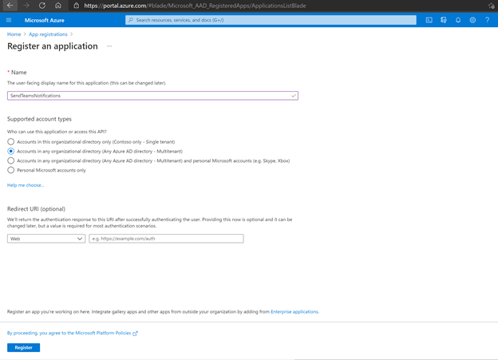

# Teams-Notification Overview and Deployment Guide

**Teams-Notification** solution is for communication with members of one or multiple O365 groups within your company tenant. This solution enables you to broadcast a notification and also bring user attention to a particular notification by sending reminders. This solution enables you to provide richer experience to users and better engage with them by keeping them up to date with your company communication and various changes regarding apps and workflows used by them. 

Use this solution for scenarios like updates about townhalls, announcements, sending content updates of Microsoft 365 Learning Pathways, such as new trainings, URLs to learn more about Microsoft Outlook, SharePoint and Teams.

## Key Features

1. **Custom Notification:** Send company wide communication through 1:1 custom messages/ adaptive cards for a more engaging experience with your users.
1. **Reminder for Notification:** Send reminders for earlier notifications at desired frequency i.e. daily, weekly, monthly through Microsoft Teams Activity Feed.
1. **Target Audience:** Choose your target audience i.e. members of one or multiple O365 groups/ teams.

## Deployment Guide
### Prerequisites 
To begin, you will need:
* An Azure account that has an active subscription. [Create an account for free.](https://azure.microsoft.com/free/?WT.mc_id=A261C142F)
* The Azure account must have permission to manage applications in Azure Active Directory (Azure AD). Any of the following Azure AD roles include the required permissions:
    * Application administrator
    * Application developer
    * Cloud application administrator
* An Office 365 account that has an active subscription of Exchange Online, Sharepoint Online and Microsoft Teams
* Office 365 account(s) with administrative rights for the following workloads -
    * Exchange Online
    * Sharepoint Online
    * Microsoft Teams
* Teams-Notification zip package. Link to [Teams-Notification package](https://github.com/swatiarora11/QuizApp/blob/master/Deployment/QuizApp.zip)

### Step 1: Register Azure AD Application
Registering your application establishes a trust relationship between your app and the Microsoft identity platform. The trust is unidirectional: your app trusts the Microsoft identity platform, and not the other way around.

Follow these steps to create the app registration:
1. Sign in to the [Azure portal.](https://portal.azure.com/)
1. Search for and select Azure Active Directory.
1. Under **Manage**, select **App registrations** > **New registration**.
    * Enter a display **Name** for your application for e.g. **TeamsNotifications**. 
    * Specify who can use the application. Select "Accounts in this organizational directory only" option for **Supported account types**.
    * Don't enter anything for **Redirect URI (optional)**.
    * Select **Register** to complete the initial app registration.

 

When registration finishes, the Azure portal displays the app registration's **Overview** pane. You see the **Application (client) ID**. Also called the **client ID**, this value uniquely identifies your application in the Microsoft identity platform. Copy the **Application (client) ID**; we will need it later. Verify that the **Supported account types** is set to "Single organization".

 

### Step 2: Setup SharePoint Online

### Step 3: Setup Microsoft Teams

### Step 4: Setup Powershell

### Step 5: Test Your First Notification

### Step 6: Test Your First Reminder
